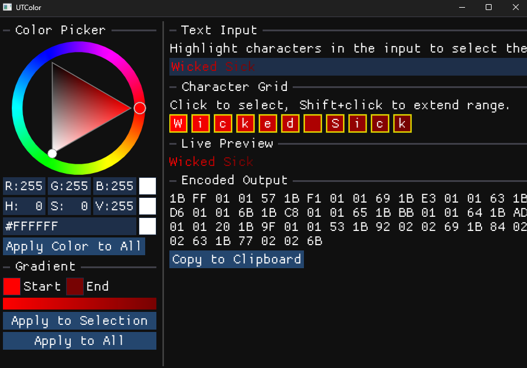

# UTColor
## UT2004 text color app



## Build

### Requirements
- CMake 3.20+
- C++17 compiler (MSVC, GCC, Clang)
- [vcpkg](https://github.com/microsoft/vcpkg)

### Windows (MSVC)

Set `VCPKG_ROOT` to your vcpkg installation, then:

```bash
cmake -B build -DCMAKE_TOOLCHAIN_FILE=%VCPKG_ROOT%/scripts/buildsystems/vcpkg.cmake
cmake --build build --config Release
```

### Linux

```bash
git clone https://github.com/microsoft/vcpkg.git
./vcpkg/bootstrap-vcpkg.sh -disableMetrics
cmake -B build -DCMAKE_TOOLCHAIN_FILE=vcpkg/scripts/buildsystems/vcpkg.cmake -DCMAKE_BUILD_TYPE=Release
cmake --build build
```

### Arch Linux

A `PKGBUILD` is provided:

```bash
makepkg -si
```